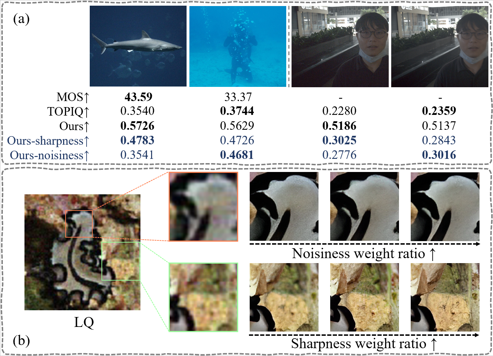
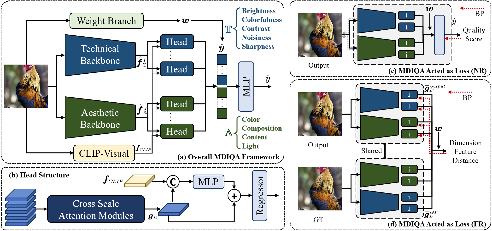

# MDIQA: Unified Image Quality Assessment for Multi-dimensional Evaluation and Restoration
#### Shunyu Yao, Ming Liu, Zhilu Zhang, Zhaolin Wan, Zhilong Ji, Jinfeng Bai, Wangmeng Zuo
This repository is the official PyTorch implementation of "MDIQA: Unified Image Quality Assessment for Multi-dimensional Evaluation and Restoration".

[](https://arxiv.org/abs/2508.16887)


#### (a) For Evaluation: our MDIQA achieves higher consistency with human subjective opinions and provides interpretable predictions through multi-dimensional quality modeling, in contrast to existing methods that output a single, opaque score.
#### (b) For Restoration: our MDIQA serves as a tunable loss for image restoration, where adjusting the weights of perceptual dimensions (e.g., sharpness or noisiness) enables adaptation to varying restoration preferences.



#### Illustration of our MDIQA. (a) Overall architecture of MDIQA. (b) The structure of each head. (c) MDIQA acted as No-Reference loss function for image restoration. (d) MDIQA acted as Full-Reference loss function for image restoration.

## ⚙️ Run
#### 1. Setup environment

```shell
git clone https://github.com/YaoShunyu19/MDIQA.git
cd MDIQA
conda create -n mdiqa python=3.10
pip install -r requirements.txt
python setup.py develop
git clone https://github.com/mlfoundations/open_clip.git
cd open_clip
sed -i '93s/return x\[0\]/return x/' src/open_clip/modified_resnet.py 
pip install -e .
```

#### 2. Download models
Download the checkpoints from [Google Drive](https://drive.google.com/drive/folders/1-RajAoPc-0v-WWQ9BnYTi-HxbpJNLZcl?usp=sharing)


#### 4. Run the training script

train backbone and head:
```shell
python MDIQA/train_shared.py -opt MDIQA/options_MDIQA/aesthetic/train_spaq_5_tech_CFANet.yml
python MDIQA/train_shared.py -opt MDIQA/options_MDIQA/aesthetic/train_para_4_aes_CFANet.yml
```
train overall iqa:
```shell
python MDIQA/train_MDIQA.py -opt MDIQA/options_MDIQA/benchmark_experiments/train_MDIQA_koniq.yml
```
train cross dataset:
```shell
python MDIQA/train_MDIQA.py -opt MDIQA/options_MDIQA/benchmark_experiments/train_MDIQA_xd_koniq.yml
```


## ✨ Datasets

You can download the datasets [here](https://huggingface.co/datasets/chaofengc/IQA-PyTorch-Datasets/tree/main).


## 🖊️ Citation

```bibtex
@misc{yao2025mdiqaunifiedimagequality,
      title={MDIQA: Unified Image Quality Assessment for Multi-dimensional Evaluation and Restoration}, 
      author={Shunyu Yao and Ming Liu and Zhilu Zhang and Zhaolin Wan and Zhilong Ji and Jinfeng Bai and Wangmeng Zuo},
      year={2025},
      eprint={2508.16887},
      archivePrefix={arXiv},
      primaryClass={cs.CV},
      url={https://arxiv.org/abs/2508.16887}, 
}
```

## 💞 Acknowledgements

Thanks for the work of [IQA-PyTorch](https://github.com/chaofengc/IQA-PyTorch). Our code is based on the implementation of them.
